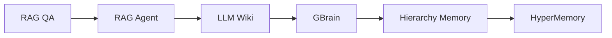

<p align="center">
  <a href="#readme">English</a>
</p>

<h1 align="center">CampusQA-Collection</h1>

<p align="center">
  <em>"A teachable evolution map from RAG QA to HyperMemory."</em>
</p>

<p align="center">
  
  
  
  
</p>

<p align="center">
  This is the special repository in the family: it keeps every method side by side and explains what changed between them.
</p>

| Base RAG | HyperMemory |
| --- | --- |
|  |  |

## What Is Inside

| Folder | Stage | Key idea |
| --- | --- | --- |
| `rag_qa` | 1 | Base document RAG. |
| `rag_agent` | 2 | Adds agent tool calling. |
| `llm_wiki` | 3 | Adds wiki-style memory from documents. |
| `gbrain` | 4 | Adds a skill layer on top of wiki memory. |
| `hierarchy_memory` | 5 | Adds layered conversation and wiki memory. |
| `hyper_memory` | 6 | Adds the final HyperMemory aggregation layer. |

All stages share the upgraded retrieval core: uploaded files are split into text chunks, Milvus stores chunk IDs, and answers receive hydrated source text instead of bare vector/document IDs.

## How To Use This Repository

Run any stage independently:

```bash
cd rag_qa
cp .env.example .env
docker compose up -d --build
```

The default URLs are:

- Frontend: `http://localhost:3000`
- Backend health: `http://localhost:8080/actuator/health`

Only run one stage at a time unless you change `FRONTEND_PORT`, `BACKEND_PORT`, and the database/storage ports.

## Tutorial And Comparison Plan

CampusQA-Collection is designed to become a GitHub Pages tutorial site. The site will let readers select any two stages and see:

- Added controllers and endpoints.
- Added services and memory layers.
- Frontend mode changes.
- Docker/runtime changes.
- Key code paths to inspect next.

Local comparison script:

```powershell
.\tools\compare-versions.ps1 -From rag_qa -To hyper_memory
```

Static tutorial site source:

```text
docs-site/
```

Main planning documents:

- [Roadmap](docs/ROADMAP.md)
- [Version matrix](docs/VERSION-MATRIX.md)
- [Comparison guide](docs/COMPARISON-GUIDE.md)
- [Operations guide](docs/OPERATIONS.md)

## Evolution Map



## Current Engineering Improvements

- Every stage now has a Vite `index.html`.
- Docker frontend images proxy `/api` through nginx to the backend.
- Runtime configuration is documented in `.env.example`.
- Docker Compose uses configurable ports and health checks.
- Spring Boot actuator health/info endpoints are exposed.
- Screenshots and tutorial docs are included at the collection root.
