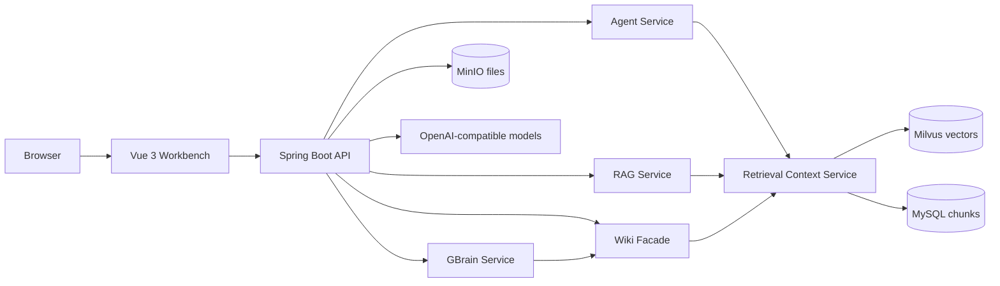

<h1 align="center">CampusAgent-QA</h1>

<p align="center">
  Agentic campus knowledge QA with <strong>RAG retrieval</strong>, <strong>LLM Wiki</strong>, and <strong>GBrain skills</strong>.
</p>

<p align="center">
  
  
  
  
  
</p>

<p align="center">
  <a href="#quick-start">Quick Start</a> ·
  <a href="docs/OPERATIONS.md">Operations</a> ·
  <a href="docs/PRODUCTION-REVIEW.md">Production Review</a>
</p>

<p align="center">
  
</p>

## Position

CampusAgent-QA is the agentic repository in the final three-repo set. It is no longer a collection of separated versions: the repo now presents one runnable application with four modes sharing the same ingestion and retrieval foundation.

| Repository | Role |
| --- | --- |
| `Harzva/CampusRAG-QA` | Baseline RAG + Wiki mode. |
| `Harzva/CampusAgent-QA` | Agent tools, Wiki memory, and GBrain skills. |
| `Harzva/HyperMemory` | Final memory-enhanced system. |

## What It Does

| Mode | Endpoint | Purpose |
| --- | --- | --- |
| RAG | `/api/chat` | Direct grounded QA over retrieved chunks. |
| Agent | `/api/agent/chat` | Uses retrieval tools instead of hardcoded FAQ answers. |
| LLM Wiki | `/api/wiki/chat` | Presents retrieved chunks as wiki-style memory. |
| GBrain | `/api/gbrain/chat` | Adds deterministic skill inspection over wiki memory. |

## Frontend Preview

The first screen is the actual workbench users operate: mode switch, upload flow, and streaming-ready chat panel.

<p align="center">
  
</p>

## Architecture



## Quick Start

```bash
cp .env.example .env
docker compose up -d --build
```

Open:

- Frontend: `http://localhost:3000`
- Backend health: `http://localhost:8080/actuator/health`
- MinIO console: `http://localhost:9001`

Set `OPENAI_API_KEY` in `.env` before expecting model-backed answers.

## Repository Layout

```text
backend/              Spring Boot API, RAG, Agent, Wiki, and GBrain services
frontend/             Vue 3 workbench
docs/assets/          README screenshots
docs/OPERATIONS.md    Runtime and endpoint notes
docs/PRODUCTION-REVIEW.md
docker-compose.yml    Full local runtime stack
.env.example          Runtime configuration template
```

## Production Readiness

See [Production Review](docs/PRODUCTION-REVIEW.md) for the detailed audit. The next highest-impact work is protecting skill execution, persisting Wiki/GBrain state, exposing tool-call traces, and Docker Compose smoke tests in CI.
