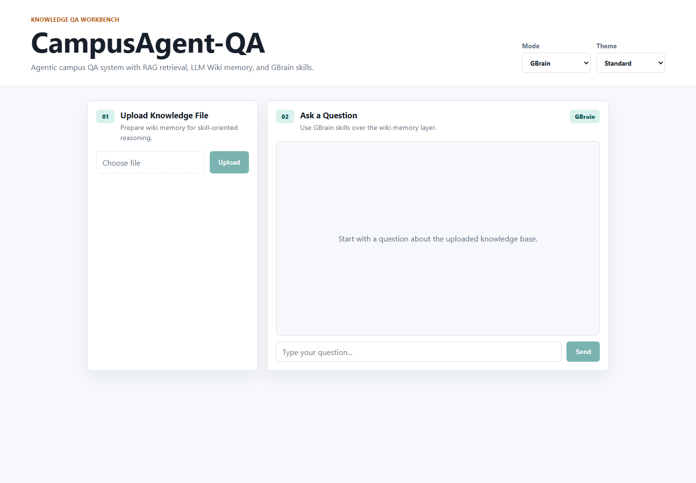
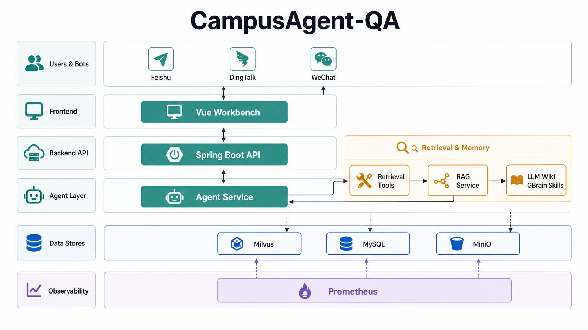
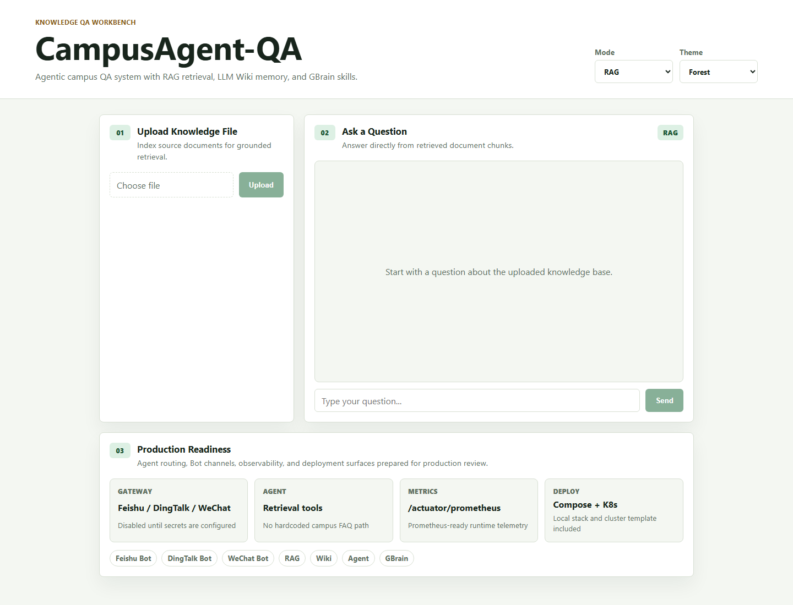
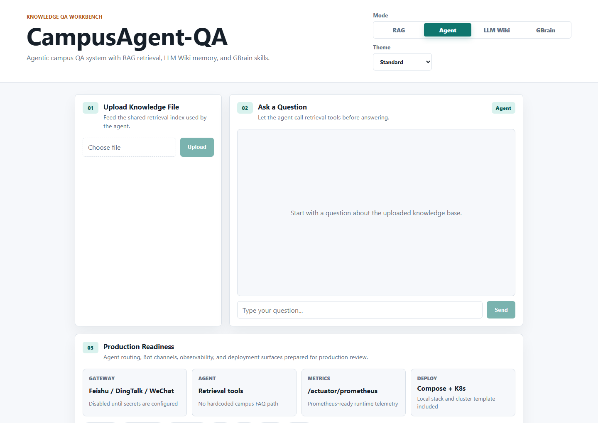
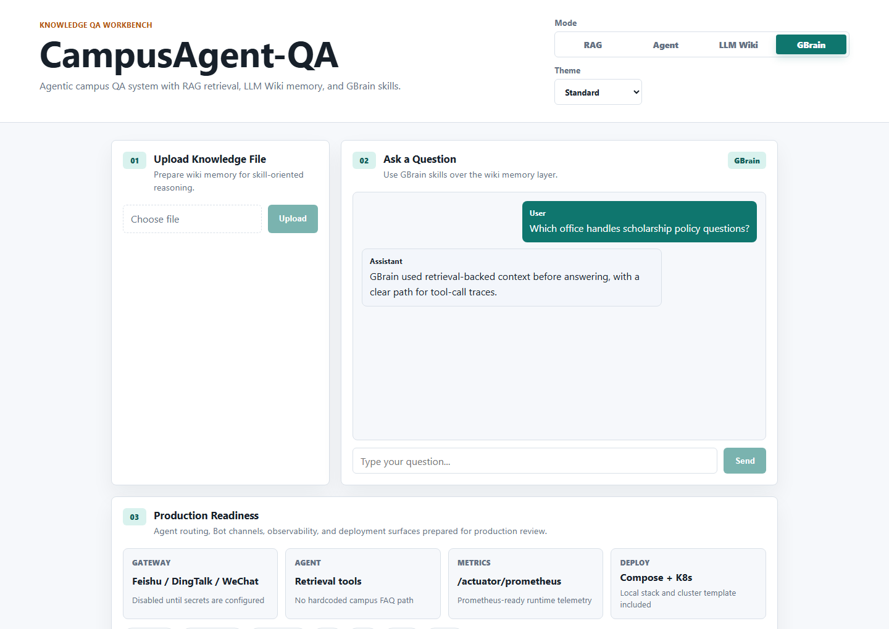
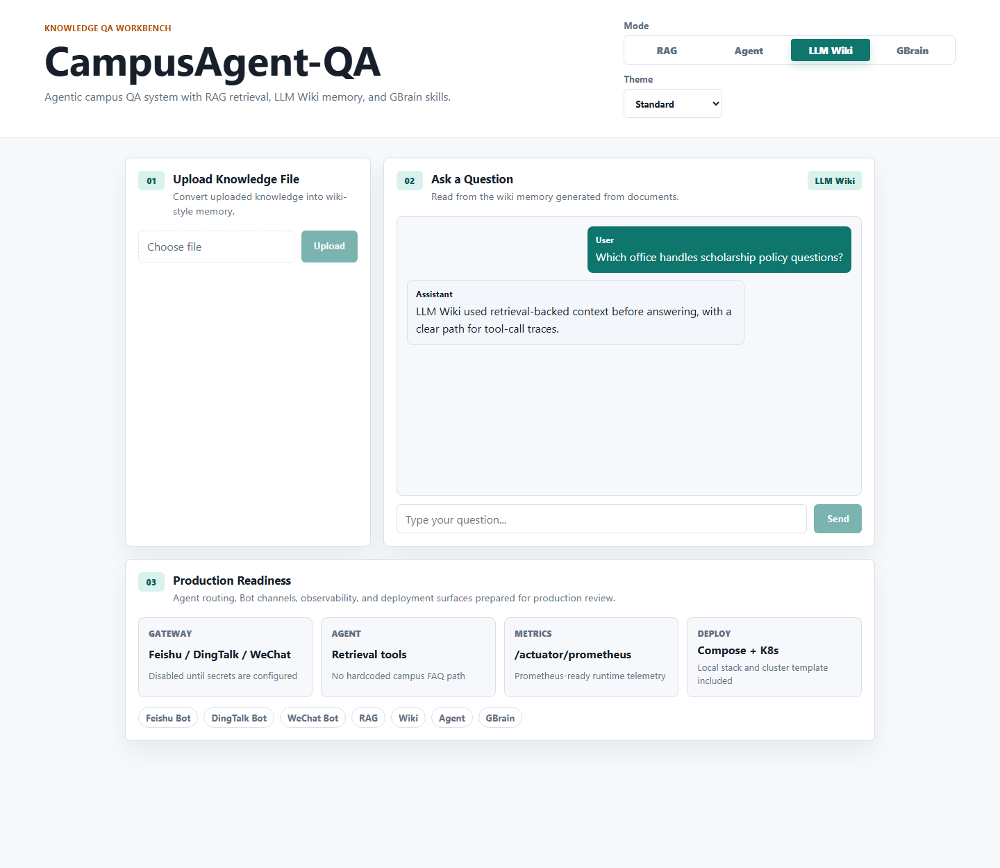
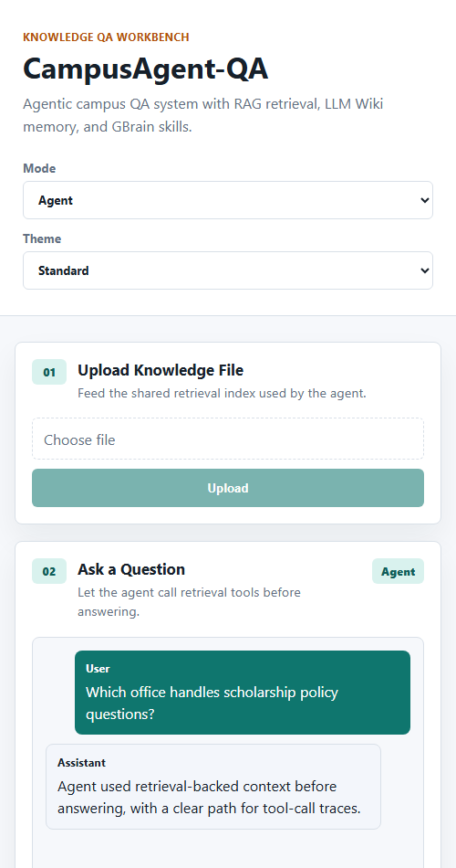
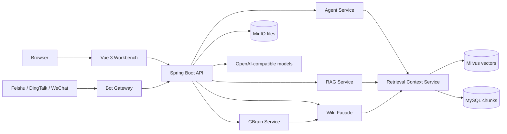

<h1 align="center">CampusAgent-QA</h1>

<p align="center">
  Agentic campus knowledge QA with <strong>RAG retrieval</strong>, <strong>LLM Wiki</strong>, and <strong>GBrain skills</strong>.
</p>

<p align="center">
  
  
  
  
  
</p>

<p align="center">
  <a href="#quick-start">Quick Start</a> |
  <a href="docs/OPERATIONS.md">Operations</a> |
  <a href="docs/PRODUCTION-ARCHITECTURE.md">Architecture</a> |
  <a href="docs/PRODUCTION-GAPS.md">Production Gaps</a> |
  <a href="docs/MAINTENANCE.md">Maintenance</a> |
  <a href="docs/BOT-INTEGRATION.md">Bot Integration</a> |
  <a href="docs/OPEN_SOURCE_REFERENCES.md">References</a>
</p>

<p align="center">
  
</p>

## Architecture Framework

<p align="center">
  
</p>

> This image is an ImageGen-rendered visual architecture map. The Mermaid diagram and OpenAPI docs remain the exact engineering contract.

## Position

CampusAgent-QA is the agentic repository in the final three-repo set. It is no longer a collection of separated versions: the repo now presents one runnable application with four modes sharing the same ingestion and retrieval foundation.

| Repository | Role |
| --- | --- |
| `Harzva/CampusRAG-QA` | Baseline RAG + Wiki mode. |
| `Harzva/CampusAgent-QA` | Agent tools, Wiki memory, and GBrain skills. |
| `Harzva/HyperMemory` | Final memory-enhanced system. |

## What It Does

| Mode | Endpoint | Purpose |
| --- | --- | --- |
| RAG | `/api/chat` | Direct grounded QA over retrieved chunks. |
| Agent | `/api/agent/chat` | Uses retrieval tools instead of hardcoded FAQ answers. |
| LLM Wiki | `/api/wiki/chat` | Presents retrieved chunks as wiki-style memory. |
| GBrain | `/api/gbrain/chat` | Adds deterministic skill inspection over wiki memory. |
| Bot Gateway | `/api/bot/{channel}/callback` | Routes normalized Feishu, DingTalk, and WeChat messages. |

## Visual Walkthrough

Six README-owned screenshots show the runnable workbench across RAG, Agent, GBrain, Bot readiness, and mobile layout.

| Dashboard | RAG mode | Agent mode |
| --- | --- | --- |
|  |  |  |

| GBrain conversation | Production readiness | Mobile |
| --- | --- | --- |
|  |  |  |

## Architecture



## Quick Start

```bash
cp .env.example .env
docker compose up -d --build
```

Open:

- Frontend: `http://localhost:3000`
- Backend health: `http://localhost:8080/actuator/health`
- MinIO console: `http://localhost:9001`

Set `OPENAI_API_KEY` in `.env` before expecting model-backed answers.

## Repository Layout

```text
backend/              Spring Boot API, RAG, Agent, Wiki, and GBrain services
frontend/             Vue 3 workbench
docs/assets/          README screenshots
docs/OPERATIONS.md    Runtime and endpoint notes
docs/PRODUCTION-ARCHITECTURE.md
docs/PRODUCTION-GAPS.md
docs/MAINTENANCE.md
docs/BOT-INTEGRATION.md
docs/SCREENSHOTS.md
docs/openapi/          API contract templates
deploy/k8s/            Kubernetes deployment template
docs/PRODUCTION-REVIEW.md
SECURITY.md            Security policy and secret-handling notes
docker-compose.yml    Full local runtime stack
.env.example          Runtime configuration template
```

## Production Readiness

See [Production Review](docs/PRODUCTION-REVIEW.md) and [Production Gaps](docs/PRODUCTION-GAPS.md) for the detailed audit. The remaining production blockers are authentication, tenant isolation, GBrain admin protection, Bot idempotency, and tool-call traces.
