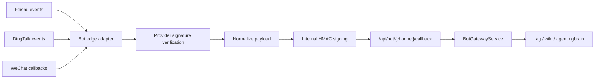

# Bot Integration Guide

The backend exposes a normalized Bot gateway so Feishu, DingTalk, and WeChat can share one routing and security model.

## Recommended Shape



The edge adapter can be a small Node.js, Go, Python, or serverless service. Its job is to handle platform-specific payloads and forward a normalized JSON request to this backend.

## Backend Configuration

```env
BOT_ENABLED=true
BOT_DEFAULT_MODE=agent
BOT_SIGNING_SECRET=replace-with-32-byte-random-secret
BOT_FEISHU_ENABLED=true
BOT_FEISHU_VERIFICATION_TOKEN=replace-me
BOT_FEISHU_SIGNING_SECRET=replace-me
BOT_FEISHU_ALLOWED_MODES=rag,wiki,agent,gbrain
BOT_DINGTALK_ENABLED=true
BOT_DINGTALK_TOKEN=replace-me
BOT_DINGTALK_SIGNING_SECRET=replace-me
BOT_DINGTALK_ALLOWED_MODES=rag,wiki,agent,gbrain
BOT_WECHAT_ENABLED=true
BOT_WECHAT_TOKEN=replace-me
BOT_WECHAT_SIGNING_SECRET=replace-me
BOT_WECHAT_ALLOWED_MODES=rag,wiki,agent,gbrain
```

## Feishu

- Configure event subscription URL: `https://<domain>/api/bot/feishu/callback` for the initial challenge, or point Feishu to an edge adapter.
- The backend supports Feishu `url_verification` challenge with `verification token`.
- For real message events, use the edge adapter to verify provider signature/encryption, extract sender and text, then forward normalized JSON.
- Send replies through Feishu Open Platform APIs from the edge adapter or a dedicated outbound worker.

## DingTalk

- For DingTalk custom robots, outgoing webhooks usually use `timestamp` plus `secret` signing.
- For incoming interactive messages or Stream Mode, terminate the DingTalk SDK/stream connection in the edge adapter.
- Normalize fields such as `conversationId`, `senderId`, `messageId`, and `text`.
- Use `BOT_DINGTALK_ALLOWED_MODES` to restrict channels to known safe modes.

## WeChat

- Prefer Official Account or WeCom callbacks for production. Personal WeChat automation can violate platform rules and is not a stable production channel.
- The backend supports WeChat GET verification by checking `sha1(sort(token, timestamp, nonce))` and returning `echostr`.
- XML/AES message parsing should happen in the edge adapter, then forward normalized JSON.
- Keep session state in Redis if you need per-user rate limits or multi-turn timeout policies.

## Internal HMAC Contract

```bash
body='{"tenantId":"school-a","conversationId":"bot-1","senderId":"u1","messageId":"m1","mode":"agent","text":"hello"}'
ts=$(date +%s)
sig=$(printf "%s.%s" "$ts" "$body" | openssl dgst -sha256 -hmac "$BOT_SIGNING_SECRET" -hex | awk '{print $2}')

curl -X POST "http://localhost:8080/api/bot/feishu/callback" \
  -H "Content-Type: application/json" \
  -H "X-Bot-Timestamp: $ts" \
  -H "X-Bot-Signature: sha256=$sig" \
  -d "$body"
```

## Minimal Node.js Edge Adapter

```js
import crypto from "node:crypto";
import express from "express";

const app = express();
app.use(express.json({ limit: "1mb" }));

const backend = process.env.BACKEND_URL ?? "http://localhost:8080";
const secret = process.env.BOT_SIGNING_SECRET;

function sign(ts, body) {
  return crypto.createHmac("sha256", secret).update(`${ts}.${body}`).digest("hex");
}

async function forward(channel, normalized) {
  const body = JSON.stringify(normalized);
  const ts = Math.floor(Date.now() / 1000).toString();
  const res = await fetch(`${backend}/api/bot/${channel}/callback`, {
    method: "POST",
    headers: {
      "content-type": "application/json",
      "x-bot-timestamp": ts,
      "x-bot-signature": `sha256=${sign(ts, body)}`
    },
    body
  });
  if (!res.ok) throw new Error(`backend ${res.status}: ${await res.text()}`);
  return res.json();
}

app.post("/feishu/events", async (req, res, next) => {
  try {
    if (req.body.type === "url_verification") {
      return res.json({ challenge: req.body.challenge });
    }
    const result = await forward("feishu", {
      tenantId: req.body.tenant_key ?? "default",
      conversationId: req.body.event?.message?.chat_id,
      senderId: req.body.event?.sender?.sender_id?.open_id,
      messageId: req.body.event?.message?.message_id,
      mode: "agent",
      text: JSON.parse(req.body.event?.message?.content ?? "{}").text ?? ""
    });
    res.json(result);
  } catch (error) {
    next(error);
  }
});

app.listen(process.env.PORT ?? 8787);
```

Before production, add provider-native signature verification, timeout handling, retry policy, and outbound reply APIs in the edge adapter.
