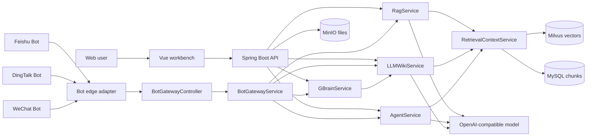
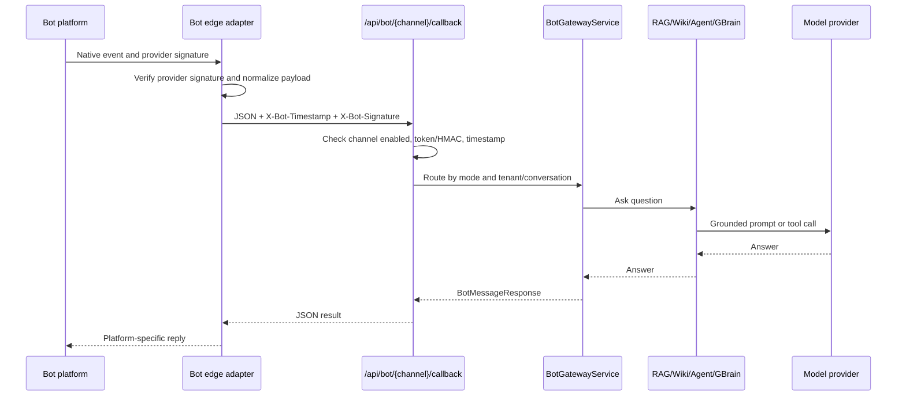

# Production Architecture

This document turns CampusAgent-QA into a deployable campus QA service with browser access and optional Bot access for Feishu, DingTalk, and WeChat.

## Goals

- Keep the runtime deployable with Docker Compose for local and small-team use.
- Expose stable APIs that can sit behind an API gateway or Bot edge adapter.
- Make failures visible through structured errors, health probes, and Prometheus metrics.
- Keep secrets out of Git and require explicit Bot channel enablement.

## Runtime Modes

| Mode | Endpoint | Purpose |
| --- | --- | --- |
| `rag` | `/api/chat` | Retrieval-augmented campus QA. |
| `wiki` | `/api/wiki/chat` | Wiki-style QA over the same retrieval core. |
| `agent` | `/api/agent/chat` | Tool-using campus assistant. |
| `gbrain` | `/api/gbrain/chat` | Skill layer over wiki memory. |
| `bot` | `/api/bot/{channel}/callback` | Normalized Feishu, DingTalk, and WeChat Bot entrypoint. |

## Architecture



## Module Boundaries

| Module | Responsibility | Production notes |
| --- | --- | --- |
| `controller/*ChatController` | Browser/API chat endpoints | Validates input and returns SSE-compatible responses. |
| `controller/BotGatewayController` | Bot callbacks and platform challenge verification | Disabled by default; requires channel config. |
| `service/BotSignatureVerifier` | HMAC/token validation for normalized callbacks | Rejects missing, expired, or invalid signatures. |
| `service/BotGatewayService` | Mode routing from Bot messages | Enforces per-channel allowed modes. |
| `service/AgentService` | Tool-using assistant | Keep tools deterministic and grounded by retrieval. |
| `service/GBrainService` | Skill-oriented layer | Good place for scheduled inspection and maintenance jobs. |
| `service/RetrievalContextService` | Retrieval abstraction | Keep as the only place that hydrates vector results into source text. |
| `exception/ApiExceptionHandler` | Stable JSON error envelope | Prevents stack traces or secret leaks in API responses. |

## Message Flow



## Normalized Bot API

`POST /api/bot/{channel}/callback`

Headers:

```http
Content-Type: application/json
X-Bot-Timestamp: 1715520000
X-Bot-Signature: sha256=<hmac-sha256(timestamp + "." + rawBody)>
```

Body:

```json
{
  "tenantId": "school-a",
  "conversationId": "feishu-chat-001",
  "senderId": "user-001",
  "messageId": "msg-001",
  "mode": "agent",
  "text": "Summarize the scholarship policy and cite the source."
}
```

## Reliability Design

| Risk | Control |
| --- | --- |
| Bot replay attack | Timestamp tolerance and HMAC signature. |
| Invalid payload | DTO validation and stable 400 response. |
| Unsupported mode | Per-channel allowed mode list. |
| Agent tool drift | Tools call retrieval instead of hardcoded FAQ logic. |
| LLM or vector store latency | Put Bot platform retries behind an edge queue; add response timeout in gateway. |
| Service restart | Docker restart policies, health probes, and graceful shutdown. |

## Performance Plan

- Cache hot retrieval results in Redis with a short TTL once traffic appears.
- Keep `TOP_K` small and tune chunk size before increasing model context.
- Use asynchronous jobs for long Agent/GBrain tasks that exceed Bot platform timeouts.
- Add idempotency by storing `(channel, messageId)` before executing the same Bot event twice.
- Use Prometheus metrics from `/actuator/prometheus` to watch latency, memory, HTTP 5xx, and JVM pauses.

## Security And Permissions

- Bot endpoints are disabled until `BOT_ENABLED=true` and a channel flag is enabled.
- Store model keys, Bot tokens, and signing secrets only in `.env`, CI secrets, or Kubernetes Secrets.
- Use `tenantId` as the future RBAC boundary: tenant, role, allowed modes, and document namespace.
- Put production traffic behind HTTPS and an ingress/API gateway with rate limits.
- Never log request bodies that may include user questions, tokens, or document content.

## Deployment Environments

| Environment | Command or action | Purpose |
| --- | --- | --- |
| Local | `cp .env.example .env && docker compose up -d --build` | Developer smoke test. |
| Test | CI build plus `docker compose config` and smoke test | Catch config drift before release. |
| Production | Build immutable images, inject secrets, deploy with health probes | Stable runtime with rollback. |

## Rollout Checklist

- Configure `OPENAI_API_KEY` and rotate any placeholder secrets.
- Set `BOT_ENABLED=true` only after Bot signing is configured.
- Enable one channel at a time: Feishu, DingTalk, then WeChat.
- Verify `/actuator/health` and `/actuator/prometheus`.
- Run one browser chat and one normalized Bot callback.
- Tag a release after deployment: `git tag v0.1.0 && git push origin v0.1.0`.
